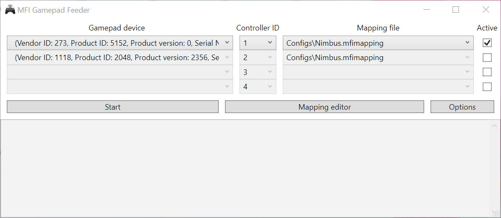
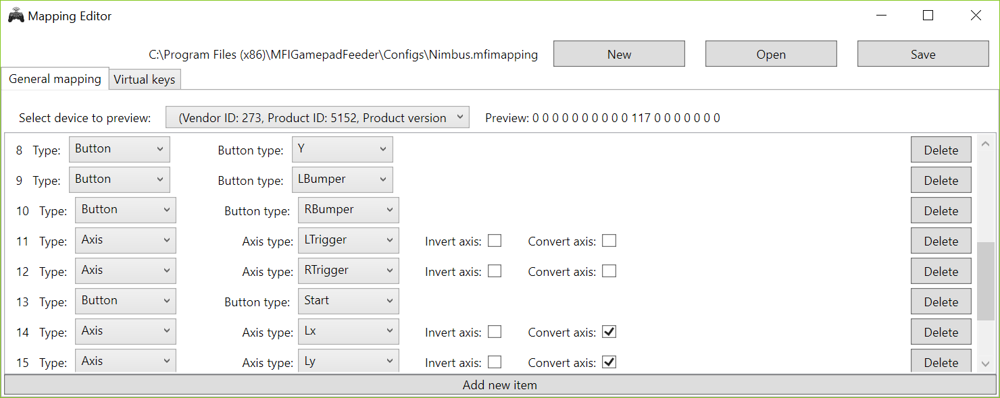
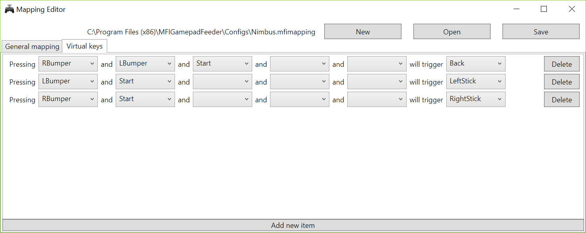

# MFI Gamepad Feeder

Have you ever wanted to use your MFI (Made for iPhone/iPad) game controller under Windows? With *MFI Gamepad Feeder* it's possible!

## How it works?

*MFI Gamepad Feeder* is a special program that works in tandem with [vGen](https://github.com/shauleiz/vGen) and [ScpVBus](https://github.com/shauleiz/ScpVBus) that creates virtual Xbox 360 controller device in your system.

It looks like modern MFI game controllers are recognized as standrad HID gamepads under Windows, but they're not visible in "USB Game Controllers", so games won't be able to use them. *MFI Gamepad Feeder* is connecing to these "HID gamepads", and it's redirecting raw input from them, directly to the ScpVBus devices.

## Requirements

Current version of *MFI Gamepad Feeder* requires

* Latest [Xbox 360 drivers](https://www.microsoft.com/accessories/pl-pl/d/xbox-360-controller-for-windows) first (Windows 7 Only).
* supported MFI Gamepad (see list of supported gamepads is listed below)

Application was tested on WIndows 10, but it should work on older systems as well.

## Installation

1. Download and install [MFI Gamepad Feeder](https://github.com/Axadiw/MFIGamepadFeeder/releases/latest "MFI Gamepad Feeder") (restart required)

2. Plug in your controllers (check compatibility list). If necessary you may need to pair them via Bluetooth.
2. Launch *MFI Gamepad Feeder* application and select:
3. Click "Active" checkbox on the right next to the first row
4. Select your gamepad from "Gamepad device" list. In my case (Steelseries Nimbus gamepad), gamepad wasn't advertising itself with correct Product name / Manufacturer Name, so I've had to guess which one it was
5. Select ID of your controller (1-4)
6. Select capping file (All configuration files are stored in the "Configs" folder in the application folder
7. Hit Start button  
8. Play your favorite games!

## Mappings editor

In order to support different types of MFI controllers you can use included mappings editor.

### HID -> XBox 360 translation

In order to create goot gamepad mapping you need to understand how **MFIGamepadFeeder** is transforming HID controllers to XBox 360 ones.

Every time you press a button / touch analog stick on you controller, your PC is recieving a small set of numbers that are describing current state of the device.

For example *SteelSeries Nimbus* is sending 18 numbers, each one is responsible for different button / axis. In order to translate these numbers, so **MFIGamepadFeeder** would be able to understand them, you need to specify meaning of each of them.

### Editor

In order to create a new mapping:

1. Select correct HID device in the "General mapping" tab. This will allow you to see preview of all the data that is coming form the controller.
2. Hit *New* button in the right top corner of the screen. 
3. Create as many mapping items as neccessary using "Add new item" button at the bottom
4. Specify type of each item:
	* Button (for all buttons on the controller)
	* DPad
	* Axis (for analog sticks and triggers)
	* Empty (for unused parameters)
5. For each item select what XBox controller role it would acquire (accordingly to the previously selected type)
6. Hit Save button

### Virtual keys

Because it isn't physically impossible to emulate all Xbox 360 buttons, even on extended MFI controllers (for example there is only "Menu" button on MFI, whilst there is "Back" and "Start" on X360), only way to use them all is using "virtual keys".

*Virtual Keys* are allowing you to translate even complicated button combinations to different button presses.

You can access *Virtual Keys* from the second tab in the *Mapping Editor*. Manual for this part of the editor is rather straightforward. 

For example this configuration:

will result in:

Pressing **RBumper**, **LBumper** and **Start** together will be changed to **Back** button.

**LBumper** + **Start** will end up with **LeftStick** press, whilst **RBumper** + **Start** will be **RightStick** press.

# Application development

I've started with support for Steelseries Nimbus controller only, if you'd like to add support for other game controller, post pull request with mapping file on [GitHub issues page](https://github.com/Axadiw/MFIGamepadFeeder/issues).

## Supported gamepads

* SteelSeries Nimbus (only via Bluetooth)

#### Not compatibile:

* Mad Catz Micro C.T.R.L i

Keep in mind that all controllers without **HID** interface won't be compatibile with *MFIGamepadFeeder*.

# Special thanks

Special thanks goes to:

**Shauleiz** ([https://github.com/shauleiz](https://github.com/shauleiz)) for vJoy and vGen 

**Nefarius** for [https://github.com/nefarius/ScpVBus](https://github.com/nefarius/ScpVBus)

**b23prodtm** ([https://github.com/b23prodtm](https://github.com/b23prodtm)) for inspiring me to integrate XBox controllers
 
**HidSharp** [http://www.zer7.com/software/hidsharp](http://www.zer7.com/software/hidsharp)

# Icon

Program icon made by Freepik (www.flaticon.com), licensed by CC BY 3.0

# License

The MIT License (MIT)

Copyright (c) 2015-2016 Michał Mizera

Permission is hereby granted, free of charge, to any person obtaining a copy of this software and associated documentation files (the "Software"), to deal in the Software without restriction, including without limitation the rights to use, copy, modify, merge, publish, distribute, sublicense, and/or sell copies of the Software, and to permit persons to whom the Software is furnished to do so, subject to the following conditions:

The above copyright notice and this permission notice shall be included in all copies or substantial portions of the Software.

THE SOFTWARE IS PROVIDED "AS IS", WITHOUT WARRANTY OF ANY KIND, EXPRESS OR IMPLIED, INCLUDING BUT NOT LIMITED TO THE WARRANTIES OF MERCHANTABILITY, FITNESS FOR A PARTICULAR PURPOSE AND NONINFRINGEMENT. IN NO EVENT SHALL THE AUTHORS OR COPYRIGHT HOLDERS BE LIABLE FOR ANY CLAIM, DAMAGES OR OTHER LIABILITY, WHETHER IN AN ACTION OF CONTRACT, TORT OR OTHERWISE, ARISING FROM, OUT OF OR IN CONNECTION WITH THE SOFTWARE OR THE USE OR OTHER DEALINGS IN THE SOFTWARE.
